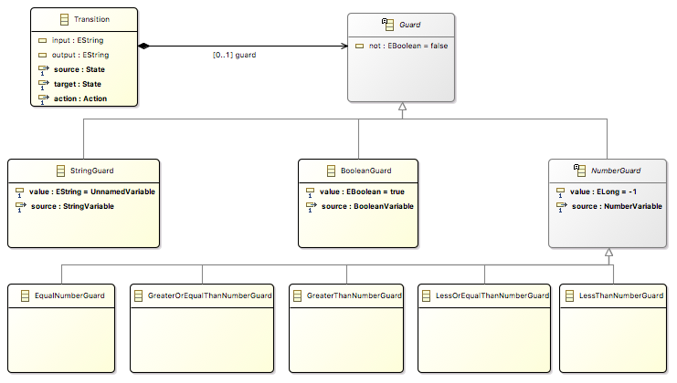
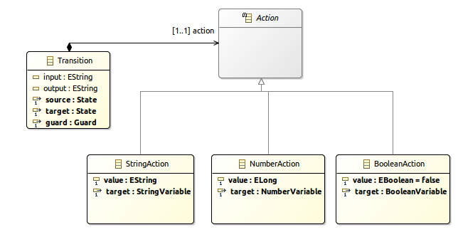
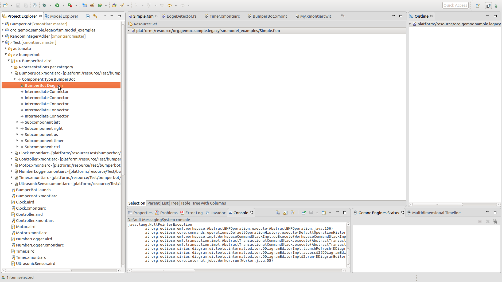
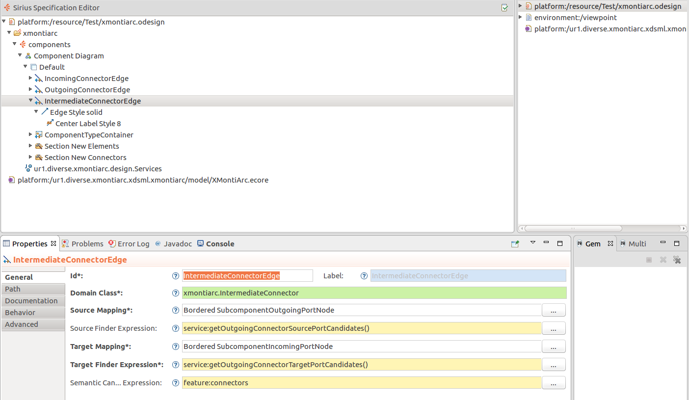
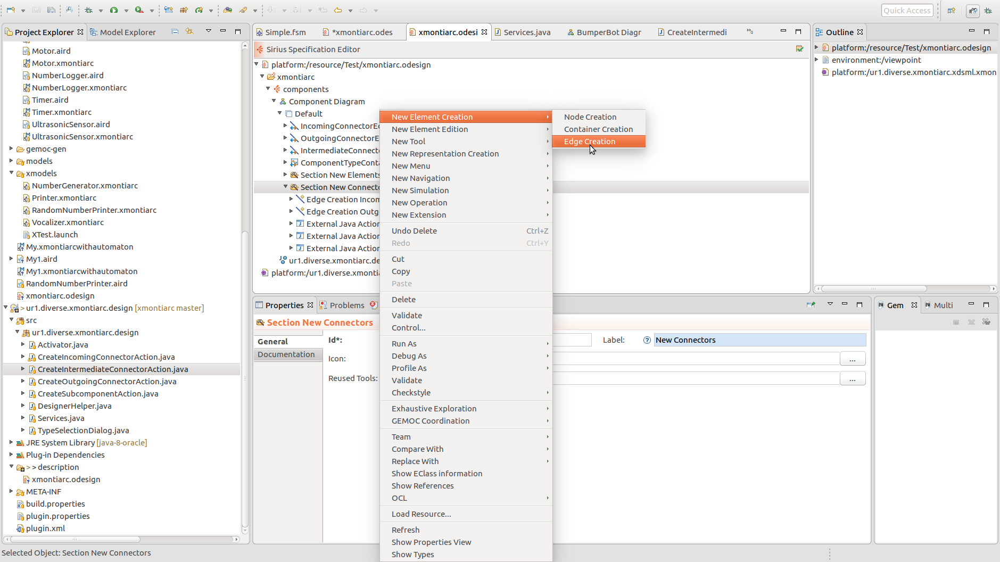
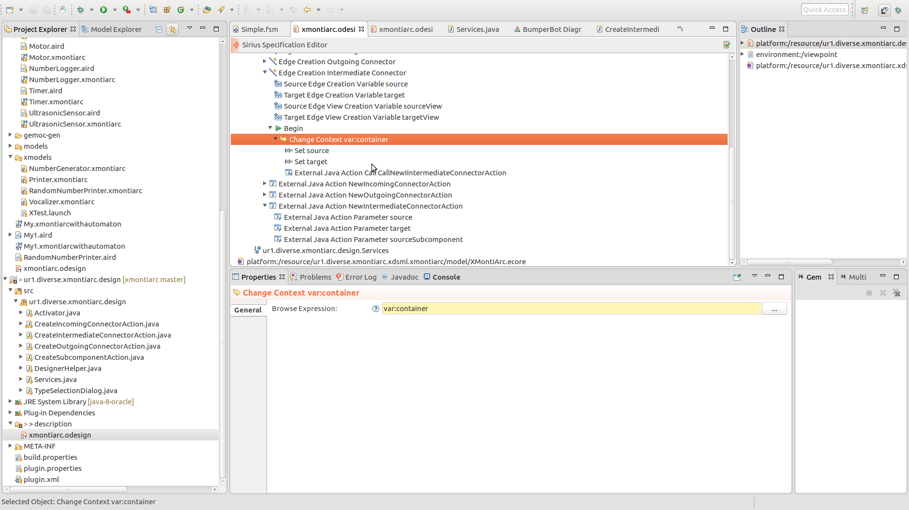
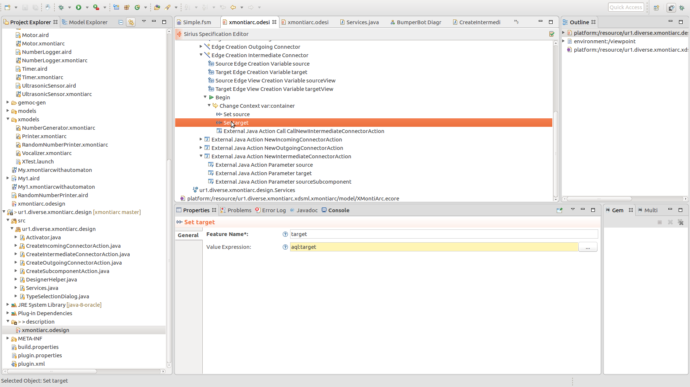
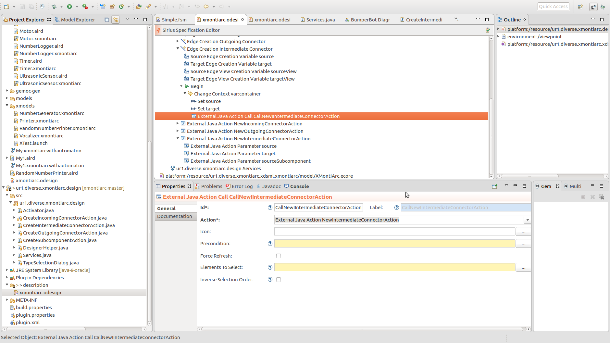

# ICSA Tutorial

* [Scope](#scope)
* [Preliminaries](#preliminaries)
* [Step 1: (Slides only)](#step-1-slides-only)
* [Step 2: Building a simple finite state machine language for specifying your component behavior](#step-2-building-a-simple-finite-state-machine-language-for-specifying-your-component-behavior)
   * [2.1 Starting from FSM Sequential example that exists in GEMOC Studio](#21-starting-from-fsm-sequential-example-that-exists-in-GEMOC-studio)
   * [2.2 Playing with the FMS language.](#22-playing-with-the-fsm-language)
   * [2.3 Adding new concepts in your language](#23-adding-new-concepts-in-your-language)
   * [2.4 Adding OCL constraints](#24-adding-ocl-constraints)
   * [2.5 Completing the dynamic semantics](#25-completing-the-dynamic-semantics)
   * [2.6 Testing the execution of the model with its new semantics](#26-testing-the-execution-of-the-model-with-its-new-semantics)
* [Step 3: Integrating FSM into a component metamodel](#step-3-integrating-fsm-into-a-component-metamodel)
* [Step 4: Composing languages](#step-4-composing-languages)


This tutorial provides a practical approach for developing and integrating various Domain-Specific (modeling) Languages (DSLs) used in the development of modern complex software-intensive systems, with the main objective to support abstraction and separation of concerns. The tutorial leverages on the tooling provided by the GEMOC studio to present the various facilities offered by the Eclipse platform (incl., EMF/Ecore, Xtext, Sirius) and introduces the advanced features to extend a DSL with a well-defined execution semantics, possibly including formal concurrency constraints and coordination patterns. From such a specification, we demonstrate the ability of the studio to automatically support model execution, graphical animation, omniscient debugging, concurrency analysis and concurrent execution of heterogeneous models. The tutorial is composed of both lectures and hands-on sessions. Hands-on sessions allow participants to experiment on a concrete use case of an architecture description language used to coordinate heterogeneous behavioral and structural components.

## Scope

During this tutorial, the participants will develop a simplified version of the [MontiArc component & connector ADL](http://www.se-rwth.de/topics/Software-Architecture.php). The ADL is tailored for designing component-based distributed interactive systems that reliy on state-based models to describe component behavior. You will use the GEMOC Studio to develop a simplified version of MontiArc, including  syntax and semantics, and deploy it in the modeling workbench to edit, execute, animate and debug conforming models. In the modeling workbench, the participants will design a software architecture based on predefined components. Based on such a design, participants will be able to concurrently execute the various components according to the execution semantics (message passing) of MontiArc, to graphically animate the architecture, and to debug the system behavior.

## Slides

- Please download the latest [GEMOC Studio](http://gemoc.org/studio.html) and provide a [Java 1.8 JDK](http://www.oracle.com/technetwork/java/javase/downloads/jdk8-downloads-2133151.html).
- The slides for the tutorials are available on [github](https://github.com/GEMOC/ICSA2017Tutorial/tree/master/slides).
- The solution is available [here]().
- Most of the documentations on GEMOC approches are available [here](http://GEMOC.org/GEMOC-studio/publish/guide/html_single/Guide.html).
- Overview slides on MontiArc and XMontiArc are [available on github](https://github.com/GEMOC/ICSA2017Tutorial/tree/master/slides/MontiArc.pptx). 
- Documentation of MontiArc's [structural](http://www.se-rwth.de/publications/MontiArc-Architectural-Modeling-of-Interactive-Distributed-and-Cyber-Physical-Systems.pdf) and [behavioral](http://www.se-rwth.de/publications/Architecture-and-Behavior-Modeling-of-Cyber-Physical-Systems-with-MontiArcAutomaton.pdf) features is available as well.


You can refer to the documentation at any time.

## Step 1: (Slides only)
- Language Engineering with GEMOC (TODO: provide slides)
- [MontiArc Introduction](https://github.com/GEMOC/ICSA2017Tutorial/tree/master/slides/MontiArc.pptx). 


## Step 2: Building a simple finite state machine language for specifying your component behavior.

### 2.1 Starting from FSM Sequential example that exists in GEMOC Studio

- Open your GEMOC Studio
- Go to a new workspace.
- Go to File -> new -> Example -> Select GEMOC FSM Language (Sequential)


This produces the general structure of a DSL project.
- org.GEMOC.sample.legacyfsm.fsm.model Contains the metamodel of your language 
- org.GEMOC.sample.legacyfsm.fsm.model.edit Contains the metamodel helper classes of your metamodel mainly Observer and Visitor Pattern  
- org.GEMOC.sample.legacyfsm.fsm.model.editor Generate a generic tree based editor for your FSM Model 
- org.GEMOC.sample.legacyfsm.fsm Contains the DSL description melange file  for your FSM language 
- org.GEMOC.sample.legacyfsm.fsm.design Contains graphical representation desciption for you FSM model Sirius based  
- org.GEMOC.sample.legacyfsm.xsfsm Contains the DSL description melange file  for your FSM language 
- org.GEMOC.sample.legacyfsm.xsfsm.design Contains graphical representation extension for you FSM model Sirius Animator  
- org.GEMOC.sample.legacyfsm.xsfsm.trace Contains the generated project for efficient executable trace management 
- org.GEMOC.sample.legacyfsm.xsfsm.xsfsm Generated executable FSM metamodel resulting from the org.GEMOC.sample.legacyfsm.xsfsm language specification melange file  


### 2.2 Playing with this language

1. Start a modelling workbench
   

2. Get the example for (GEMOC model for FSM Sequential)


- Open the bitshifting.aird file: there you can see and edit the FSM model.

Next: Run this model. To this effect, open the *run* dialog:

- Run in **debug mode** the **BitShifting.fsm 000101010** run configuration.

You then can play with the debug model by stepping through it and observing the state transitions.


​:warning: You can now close the modelling workbench


### 2.3 Adding new concepts in your language

Just open your FSM metamodel in the language workbench.

1. Add the concept of `Variable` that has a name to the FSM. Add three subclasses : a `StringVariable`, `BooleanVariable`, and a `NumberVariable`as depicted below:


2. Add theconcept of Guard to the Transition. Add eight subclasses : a `StringGuard`, a `BooleanGuard`and an abstract `NumberGuard`, a `EqualNumberGuard`, a LessThanNumberGuard`,a GreaterThanNumberGuard, a GreaterOrEqualThanNumberGuard`, and a `LessOrEqualThanNumberGuard` .



3. Add the concept of `Action` to the Transition. Add three subclasses : a `StringAction`, a `BooleanAction`, and a `NumberAction`.



​:warning:​ At the end of this task, you must regenerate the Java code for your metamodel. Right click on the *fsm.genmodel* in the same folder as the metamodel and select reload. Next open it and in the tree editor, right click and select *regenerate all*.


### 2.4 Adding OCL constraints

In our language, you can define your static semantics (i.e., well-formedness rules) using OCL. Let us try to define that a state cannot have two outgoing transitions without a guard. To this effect, open the metamodel with the *OCLinEcore editor* via right clicking it and selecting that editor. Here, you can create an `invariant` for the concept `State`that restricts its outgoing transitions.

+ The official OCL documentation is [available online](http://download.eclipse.org/ocl/doc/5.0.0/ocl.pdf) as well as there is a [set of slides on it](https://de.slideshare.net/EdWillink/enrich-your-models-with-ocl).
+ A tutorial on the OCLinEcore editor is available from the [eclipse wiki](https://wiki.eclipse.org/OCL/OCLinEcore) and a getting started guide is available from the [eclipse help website](http://help.eclipse.org/neon/index.jsp?topic=%2Forg.eclipse.ocl.doc%2Fhelp%2FGettingStarted.html).

After creating the *invariant*, start the modeling workbench again and open the **BitShifting** model again. Right click on it and select validate. Now eclipse marks all states as erroneous as none uses a guarded transition.


### 2.5 Completing the dynamic semantics

For temporal constraints, we provide an implementation of the FSM dynamic semantics. We suggest, to restart from the FSM version in the [archive for step 2.5](https://github.com/gemoc/ICSA2017Tutorial/tree/master/2.5). Prior to that, delete all projects from your workspace.

The operational semantics of FSM are defined in the following Xtend file, which employs Kermeta and the [Interpreter Design Pattern](https://en.wikipedia.org/wiki/Interpreter_pattern) to describe the dynamic behavior of FM models: 

- org.gemoc.sample.legacyfsm.fsm.k3dsa/src/org/gemoc/sample/legacyfsm/fsm/k3dsa/tfsmAspects.xtend, 

We left two methods unimplemented with TODO. Try to implement these two methods.

TODO: decide upon which methods to leave underspecified

​:warning: Execution Functions

The Execution Functions define how the Execution Data evolve during the execution of the model. Execution Functions can be implemented by defining the body of a method. These methods must be annotated with the **@Step** annotation. Whenever a method with an @Step annotation returns, the changes in the model will be applied (via a transaction) to the resource. This means that the changes will be visible from an animator. K3 supports nested @Step annotation calls so that changes in the model will be applied when entering and leaving methods having this annotations.

​:warning: Entry Points

The GEMOC sequential engines uses methods annotated with **@Main** as entry points to model execution. This annotation must be placed on operations applicable to the root model element.

### 2.6 Testing the execution of the model with its new semantics

Let's run the modelling workbench!

Create a FSM model with two steps and one transition. Create a variable `a` with `1` as an initial step. Create a guard associated to the transition that checks whether `a == 1`.  Create an action that assigns `2` to the variable `a`.


Let's debug this model!

1. Create the debug configuration


2. You can then debug your language


## Step 3: Integrating FSM into a component metamodel

// TODO: the title is wrong. Here we add graphical editing capabilities

For temporal restrictions, we provide to you the meta model, the odesign, and the initial semantics. In this step, we propose to show you how we could use the [Sirius](https://www.eclipse.org/sirius/doc/specifier/diagrams/Diagrams.html) framework to specify the graphical representation of a language. To show this, we aim to draw unidirectional connectors between ports using Sirius. This includes:

1. Defining what you have to draw when for each `IntermediateConnector` in the model.
2. Defining what you have to draw and set when you add a new `IntermediateConnector` to the diagram.

Let us import an example model (from project *Test*) to understand the current diagram specification in the modelling workbench.

TODO: Where do they get test from?

TODO: Rename test to ICSA2017Example

In this project, open the file */Test/bumperbot/BumperBot.aird* and in the project explorer, open the BumperBot diagram. See below:




In the modelling workbench, let us also import the project *ur1.diverse.xmontiarc.design*. The good thing is that an odesign project is interpreted. As a result, you can modify the odesign diagram specification and just reload the diagram to see the impact.


Sirius is organized to query the model and create representation from the results of the queries. To draw the connector, we have to find each couple of port between which the connector must be drawn.

Let us create an element based edge. On the default Viewpoint, create a new Element based Edge.  You can customize the style. Next you have to specify the query. In our case, all the `IntermediateConnector` have a source and a target and we map the border of the source and the border of the target. Finding the source and the target can be done using Java and AQL. We propose to use Java.



Next, we have to create the action to do when we draw a new `IntermediateConnector` between port. To this end, in section *Edge Section Connector* in the odesign, create a new Edge Creation.



This node gives you five subelements. Four that define the `source` and the `target` model elements pointed by your edge, the `source view`and the `target view` pointed by your edge. Also, it defines the action to execute when creating this edge. Basically, we will change the execution context for this action, create two variable and call an external Java action already define. The source code of this action is the following.


```Java
package ur1.diverse.xmontiarc.design;

import java.io.IOException;
import java.util.Collection;
import java.util.Map;

import org.eclipse.emf.ecore.EObject;
import org.eclipse.sirius.business.api.action.AbstractExternalJavaAction;
import org.eclipse.sirius.tools.api.ui.IExternalJavaAction;

import ur1.diverse.xmontiarc.xdsml.xmontiarc.xmontiarc.ComponentType;
import ur1.diverse.xmontiarc.xdsml.xmontiarc.xmontiarc.IncomingPort;
import ur1.diverse.xmontiarc.xdsml.xmontiarc.xmontiarc.IntermediateConnector;
import ur1.diverse.xmontiarc.xdsml.xmontiarc.xmontiarc.OutgoingPort;
import ur1.diverse.xmontiarc.xdsml.xmontiarc.xmontiarc.Subcomponent;
import ur1.diverse.xmontiarc.xdsml.xmontiarc.xmontiarc.XmontiarcFactory;

public class CreateIntermediateConnectorAction extends AbstractExternalJavaAction implements IExternalJavaAction {

	@Override
	public boolean canExecute(Collection<? extends EObject> arg0) {
		return true; // we can always add IntermediateConnector instances
	}

	@Override
	public void execute(Collection<? extends EObject> args, Map<String, Object> options) {
        // Load information from arguments
		OutgoingPort subcomponentOut = (OutgoingPort) options.get("source");
		IncomingPort subcomponentIn = (IncomingPort) options.get("target");
		Subcomponent sourceSubcomponent = (Subcomponent) options.get("sourceSubcomponent");
        // Identify containing component type
		ComponentType type = sourceSubcomponent.getParent();
        // New connector
		IntermediateConnector con = XmontiarcFactory.eINSTANCE.createIntermediateConnector();
		con.setSource(subcomponentOut);
		con.setTarget(subcomponentIn);
        // Add connector to component type 
		type.getConnectors().add(con);
		try {
			type.eResource().save(null); // Save model
		} catch (IOException e) {
			e.printStackTrace();
		}
		System.out.println("Connectors '" + type.getConnectors() + "'.");
	}

}
```

You can see in the next figures, the different configuration for these elements.








Please refer to the [Sirius documentation](https://www.eclipse.org/sirius/doc/specifier/diagrams/Diagrams.html) for learning and you can configure in details your editor.


## Step 4: Composing languages

This step is the most elaborate part of the tutorial. We aim to create a new language by composing our FSM with the MontiArc metamodel. To this end, we will use Melange, which lets you create a language by composing several sublanguages. To continue, please import the project from the [following archive file](3.0/3.0.zip).

The project *ur1.diverse.xmontiarc.xdsml.withautomaton* contains the Melange model defining our composed language in 

- *src/ur1/diverse/xmontiarc/xdsml/withautomaton/xmonticorewithautomon.melange*

The quintessential excerpt of this model is given below. It shows that we extend XMontiArc via inheritance (l. 1) and merge the concept fsm.StateMachine to xmontiarc.AutomatonComponentBehavior. This ultimately composes both metamodels.

```java
language XMontiArcWithAutomaton inherits XMontiArc{
	merge XSFSM renaming {"fsm" to "xmontiarc" {"StateMachine" to "AutomatonComponentBehavior" }}
}
```

It remains to create glue code for the semantics. Lets do that together!
